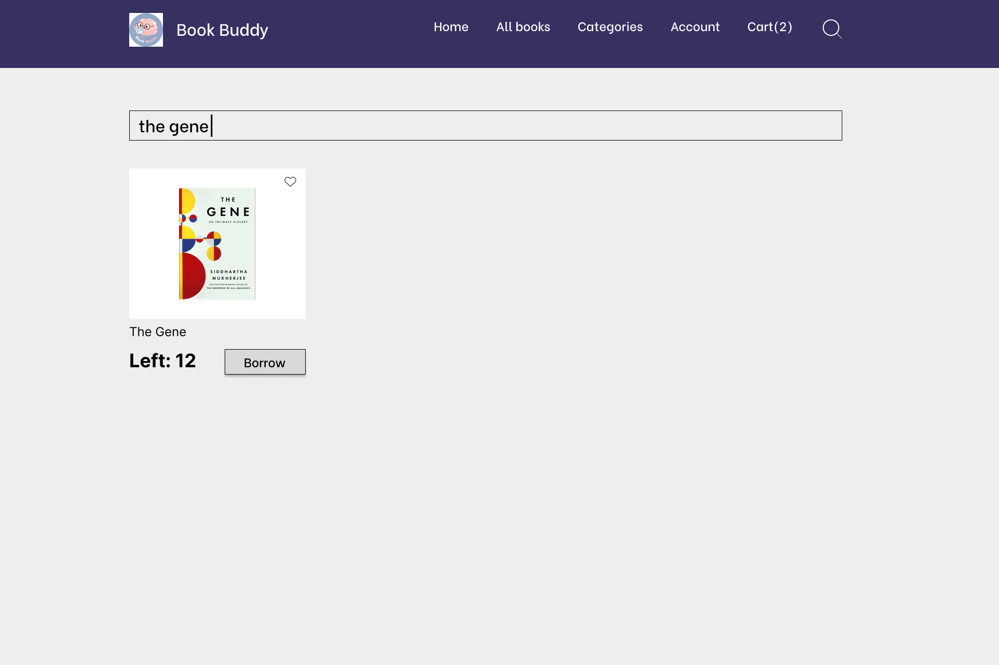

# Report

# Book Buddy Library - Team 6

## Table of Contents

1. [Team Overview and Timeline](#1-team-overview-and-timeline)
   1. [Team Members](#11-team-members)
   2. [Project Milestones and Deadlines](#12-project-milestones-and-deadlines)
2. [Project Proposal](#2-project-proposal)
   1. [Overview of the Project](#21-overview-of-the-project)
   2. [Objectives](#22-objectives)
3. [Technical Specifications](#3-technical-specifications)
   1. [Tech Stack](#31-tech-stack)
      1. [Backend](#311-backend)
      2. [Frontend](#312-frontend)
      3. [Database](#313-database)
   2. [Reasons for Choosing the Tech Stack](#32-reasons-for-choosing-the-tech-stack)
4. [Software Analysis](#4-software-analysis)
   1. [Requirements](#41-requirements)
   2. [Functional Requirements](#42-functional-requirements)
   3. [Non-functional Requirements](#43-non-functional-requirements)
   4. [UML Diagrams](#44-uml-diagrams)
   5. [UI Prototype](#45-ui-prototype)
5. [Software Design](#5-software-design)
   1. [Folder Structure](#51-folder-structure)
   2. [System Architecture](#52-system-architecture)
6. [Testing](#6-testing)
   1. [Test Cases](#61-test-cases)
   2. [Testing with Selenium IDE](#62-testing-with-selenium-ide)
7. [Deployment](#7-deployment)
   1. [Why Vercel?](#71-why-vercel)
   2. [Cost-Saving Advantages of Using Vercel](#72-cost-saving-advantages-of-using-vercel)
   3. [Prerequisites and Deployment Process with Vercel](#73-prerequisites-and-deployment-process-with-vercel)
8. [Containerization](#8-containerization)
   1. [Why Docker?](#81-why-docker)
   2. [How to Implement Docker Images](#82-how-to-implement-docker-images)
   3. [Sharing Docker Images](#83-sharing-docker-images)
      1. [User Website](#user-website)
      2. [Admin Website](#admin-website)
9. [Security and Privacy Policy](#9-security-and-privacy-policy)
   1. [Security](#91-security)
   2. [Privacy Policy](#92-privacy-policy)
10. [Conclusion](#10-conclusion)
   1. [Summary of the Project and Outcomes](#101-summary-of-the-project-and-outcomes)
   2. [Future Work](#102-future-work)
11. [References](#11-references)

## 1. Team Overview and Timeline

### 1.1. Team Members

#### Group 6

Team members: 
- Phan Huỳnh Anh Thư (Leader)
- Đặng Thị Anh Thư @dangthu2312002
- Nguyễn Nhựt Thành @ga1nang
- Huỳnh Đăng Trình @DangTrinhCSE2021
- Lưu Minh Khang @10421024
- Phan Khánh Nghị @10421094
- Huỳnh Minh Tường @10421117
- Nguyễn Hồ Tấn Đạt @10421071
- Nguyễn Hoàng Nguyên @10421096

### 1.2. Project Milestones and Deadlines

 - 05.03.2024 - *Introduction:* Our team was formed, and we chose to undertake the Online Library Management project. This initial phase involved assembling a group of motivated members and deciding on the project's scope and objectives.
 - 12.03.2024 - *Analyzing requirements and project proposals:* During this week, we focused on analyzing the project requirements and creating a detailed project timeline. We also had in-depth discussions to select the technical stack that would best suit our needs for the development of the online library management system.
 - 19.03.2024 - *Analysis:* We progressed to the analysis stage, where we designed the use-case diagram to map out the system's functionalities. This session also included finalizing our technical stack and learning best practices for front-end documentation, ensuring a solid foundation for the project.
 - 26.03.2024 - *Modules, sequence diagram:* In this phase, we designed the sequence diagram, which helped us understand the interactions between various system components. Additionally, we focused on learning back-end documentation practices to maintain clear and comprehensive records of our development process.
 - 02.04.2024 - *ER diagram, database and UI:* ER diagram, database and UI: Our efforts this week were directed towards designing the ER diagram and database schema, defining tables and relationships essential for the library system. We also worked on designing the library logo and sketching out the user interfaces for both admin and regular users. 	
- 23.04.2024 - *Design, deployment diagram:* ER diagram, database and UI: Our efforts this week were directed towards designing the ER diagram and database schema, defining tables and relationships essential for the library system. We also worked on designing the library logo and sketching out the user interfaces for both admin and regular users.
- 29.04.2024 - *Prepare to implement:* At this stage, we outlined the system's architecture, detailing both back-end and front-end components. We also began gathering and preparing book data for the database, including information such as author names, book titles, and ISBNs.
- 15.05.2024 - *Back-end implementation:* This week marked the beginning of the back-end implementation phase, where we developed key functionalities like user registration, authentication, and authorization, laying the groundwork for a secure and efficient library management system.
- 04.06.2024 - *Front-end implementation:* In the this phase, we focused on the front-end implementation, specifically working on the interfaces for the admin page. This involved translating our design sketches into functional web pages, ensuring that the admin could efficiently manage the library’s resources through a user-friendly interface.
- 11.06.2024 - *Security and privacy:* The team successfully implemented and tested authentication mechanisms for both admin and user accounts. Additionally, authorization protocols for administrators were established, and comprehensive documentation was completed to ensure ongoing security compliance and system integrity.
- 18.06.2024 - *Upgrading requirements:* Significant advancements were made, including the addition of comprehensive statistics for books, readers, and late returns, alongside the enhancement of the admin web interface design. Furthermore, rigorous unit and Selenium tests were conducted to ensure reliability, followed by the successful deployment of both the user and admin websites.
- 25.06.2024 - *Updating analysis and design for version 2:* The project successfully incorporated containerization using Docker to enhance deployment efficiency and scalability. Additionally, the user web interface design was refined, and thorough documentation was completed to support these updates.
- 01.07.2024 - *Project Completion:* In the final phase of Project Completion, the team has successfully completed all documentation, ensuring comprehensive coverage of all project aspects. Additionally, preparations for the project presentation have been finalized, setting the stage for a thorough and effective project review.

## 2. Project Proposal

### 2.1. Overview of the Project

Project Title: BookBuddy Library Management System

The project is creating an online library administration system meant to simplify book renting and review procedure. Two separate interfaces—an administrative and a user interface—will be included into the program. Registered users will be able to rent books for a designated period, search the library's collection, filter books by author, category, or publishing, and so navigate the user interface Additionally able to pay for rentals straight through the app, users will be able to like and evaluate books they have read, therefore supporting a community-driven assessment system.

From the administrative standpoint, the administrative interface will let library employees effectively handle book inventory. Administrators may track rental book availability, change current listings, and list new books. To guarantee prompt returns and best book circulation, the system will also have features to track late rentals and send email alerts to consumers when their lease expiry dates get near.

Using contemporary web technologies and a user-centric design, this application seeks to improve the operational effectiveness and user experience of the library. By means of a safe and flawless login experience offered by the connection with Google for authentication, users are guaranteed that only authorised persons may access the system. This project not only meets the present demands of the library but also lays the groundwork for further improvements like sophisticated search features and tailored suggestions depending on user preferences and reading background.

### 2.2. Objectives

The creation of a comprehensive library administration system that would completely automate the processes involved in library administration is the goal of this project. The indexing of books, the administration of users, the borrowing and returning of books, and the tracking of books that are long overdue are all processes that will be included in these procedures.

## 3. Technical Specifications

### 3.1. Tech Stack

#### Backend

- **Next.js**: Beyond its frontend capabilities, Next.js is used to handle server-side logic and API requests, providing a full-stack solution.

#### Frontend

- **React**: Utilized for building the user interface, providing a dynamic and responsive experience.
- **Next.js**: A React framework for server-side rendering and API route handling, enhancing SEO and performance.
- **Tailwind CSS**: A utility-first CSS framework used for styling the application efficiently and effectively.
- **Styled-components**: Used for writing actual CSS in JavaScript, enabling the use of component-level styles in the application.

#### Database

- **MongoDB**: A NoSQL database chosen for its flexibility and scalability in storing and retrieving application data.
- **Mongoose**: An Object Data Modeling (ODM) library for MongoDB, used to interact with the database using schemas and models.

### 3.2. Reasons for Choosing the Tech Stack

- **React**: Selected for its ability to create highly interactive and dynamic user interfaces.
- **Next.js**: Chosen for its powerful features like server-side rendering, static site generation, and built-in API routes which enhance both SEO and performance.
- **Tailwind CSS**: Preferred for its utility-first approach, making it easy to build responsive and modern designs quickly.
- **Styled-components**: Allows writing CSS directly within JavaScript, which helps in creating scoped and maintainable styles.
- **MongoDB**: Opted for its schema-less nature, which provides flexibility in storing diverse data types and scalability for growing application needs.
- **Mongoose**: Used for its robust schema and model capabilities, simplifying interactions with MongoDB and ensuring data consistency.

## 4. Software Analysis

### 4.1. Requirements

This is the requirements specification document for our Library Management System (LMS). The document is designed to provide a comprehensive outline of the functional and non-functional requirements necessary for the development of a robust, user-friendly, and secure library management system. Our system will modernize the management of library resources, improve user experience for patrons, and enhance the operational efficiencies for library staff.

### 4.2. Functional Requirements

**1. User Authentication and Authorization:**
Users should be able to register and log in with unique credentials.
Different access levels should be defined (e.g., librarian, administrator, patron) with corresponding privileges.
Librarians should have additional privileges like adding/editing books, managing memberships, etc.

**2. Book Management:**
Add new books to the system with details like title, author, ISBN, genre, publication year, etc.
Update book information (e.g., availability status, quantity).
Search functionality allowing users to search for books by various criteria (e.g., title, author, genre).
Reserve and borrow books for registered users.
Check-in and check-out books.

**3. Member Management:**
Register new members with their personal information.
Update member information (e.g., contact details, membership status).
Track borrowing history for each member.
Send notifications for overdue books or membership renewals.

**4. Reporting and Analytics:**
Generate reports on book inventory, borrowing trends, popular genres, etc.
Provide analytics to help in decision making (e.g., which books are frequently borrowed, membership trends).

**5. System Administration:**
Admin panel for managing system settings, user accounts, and permissions.
Backup and restore functionality for data security.

### 4.3. Non-functional Requirements

**1.  Performance:**
The system should respond to user actions within a reasonable time frame (e.g., search queries, book check-in/check-out).
It should handle concurrent users efficiently without significant performance degradation.

**2. Scalability:**
The system should be able to accommodate a growing number of books, members, and transactions without a significant decrease in performance.

**3. Reliability:**
The system should be available 24/7 with minimal downtime for maintenance.
Data integrity should be maintained even during system failures or crashes.

**4. Security:**
User data (including personal information and borrowing history) should be encrypted and protected from unauthorized access.
Role-based access control should be implemented to ensure that users only have access to functionalities appropriate for their role.

**5. Usability:**
The user interface should be intuitive and easy to navigate for both librarians and patrons.
Proper error handling and user feedback mechanisms should be in place to assist users in case of mistakes or system failures.

**6. Compatibility:**
The system should be compatible with different devices and browsers to ensure accessibility for users regardless of their preferred platform.
Regulatory Compliance:

The system should comply with relevant data protection regulations (e.g., GDPR, HIPAA) to ensure the privacy and security of user data.

### 4.4. UML Diagrams

Link of diagrams development: [click here](https://drive.google.com/file/d/1nqhHMsy8dLLqSbGBy9q2obxAGh9Ejhm8/view?usp=sharing) 

#### Use Case diagram


#### Sequence diagram
##### User aspect


##### Admin aspect


#### Activity diagram
##### User aspect

##### Admin aspect


#### Class diagram


#### Deployment diagram


#### Database
##### Entity relationship diagram


#### Component design


### 4.5. UI Prototype

#### Low fidelity sketch with Miro
 [Miro link: click here](https://miro.com/app/board/uXjVKUyu9fU=/?share_link_id=749514101279)
#### High fidelity sketch with Figma
##### User interfaces
[Figma user interfaces: click here](https://www.figma.com/file/bI64s4ggzAT64ccRURrzdm/Library?type=design&node-id=0%3A1&mode=design&t=wqVk07Rl8MK12OsY-1)
###### Home page
   
###### All books page
   
###### Book detail page
   
###### Cart page
   
###### Category page
   
###### Orders page
   
###### Wishlist page
   
###### Search page
   
###### Filter page
   

##### Admin interfaces
[Figma admin interfaces: click here](https://www.figma.com/design/Ut6RA5Lor1HcyobNmiZlEe/Dashboard?node-id=0-1)
###### Dashboard
   
###### Books page
   
###### Add new book page
   
###### Category page
   
###### Orders page
   
###### Reminder
   
###### Setting
   

## 5. Software Design

### 5.1. Folder Structure

#### Admin Page:
##### Root Directory

- **adminLibrary/**
  - The main directory for your Library Management Application's admin panel.

##### Admin Application Directory

- **BooksBuddy-admin/**
  - The primary folder for the admin application, containing all the subfolders and files.

##### Components Directory

- **components/**
  - Contains reusable React components used throughout the application.

  - **Layout.js**: 
    - **Purpose**: The layout component for structuring the page. It serves as the wrapper for all other components and includes common elements like headers, footers, and sidebars.
    - **Details**: Typically includes methods to manage page transitions and layout-specific props.

  - **Logo.js**:
    - **Purpose**: Component for displaying the application logo.
    - **Details**: Usually contains the logo image or SVG and optional links to the home page.

  - **MiniNav.js**:
    - **Purpose**: Component for a smaller version of the navigation bar, used in compact views or mobile devices.
    - **Details**: Includes menu items and links in a more compact layout compared to the main navigation bar.

  - **Nav.js**:
    - **Purpose**: Component for the main navigation bar, providing primary navigation links and menus.
    - **Details**: May include dropdown menus, icons, and links to major sections of the admin panel.

  - **ProductForm.js**:
    - **Purpose**: Component for the product form, used for adding or editing products.
    - **Details**: Contains form fields, validation logic, and submission handlers for product data.

  - **Spinner.js**:
    - **Purpose**: Component for displaying a loading spinner, indicating ongoing operations or data fetching.
    - **Details**: Can be customized with different sizes, colors, and animation styles.

##### Library Directory

- **lib/**
  - Contains utility libraries and helper functions that support various parts of the application.

  - **mongodb.js**:
    - **Purpose**: MongoDB connection setup.
    - **Details**: Includes connection logic, error handling, and configuration for connecting to the MongoDB database.

  - **mongoose.js**:
    - **Purpose**: Mongoose configuration and schema setup.
    - **Details**: Defines Mongoose schemas and models, managing data structure and validation.

##### Models Directory

- **models/**
  - Contains Mongoose models for the application's data entities.

  - **Category.js**:
    - **Purpose**: Mongoose model for product categories.
    - **Details**: Defines the schema for product categories, including fields like name and description.

  - **Order.js**:
    - **Purpose**: Mongoose model for orders.
    - **Details**: Defines the schema for orders, including fields like order items, customer details, and status.

  - **Product.js**:
    - **Purpose**: Mongoose model for products.
    - **Details**: Defines the schema for products, including fields like name, price, description, and category.

##### Pages Directory

- **pages/**
  - Contains Next.js pages, organized based on routing structure.

  - **api/**:
    - **Purpose**: Contains API routes for handling backend logic.

    - **auth/**:
      - **Purpose**: Contains authentication-related API routes.
      - **[...nextauth].js**: NextAuth configuration for authentication, managing login, signup, and session handling.

    - **categories.js**:
      - **Purpose**: API route for handling category-related operations like CRUD operations for categories.

    - **hello.js**:
      - **Purpose**: A sample API route, often used for testing or initial setup.

    - **orders.js**:
      - **Purpose**: API route for handling order-related operations, including CRUD operations for orders.

    - **products.js**:
      - **Purpose**: API route for handling product-related operations, including CRUD operations for products.

    - **upload.js**:
      - **Purpose**: API route for handling file uploads, managing storage and validation of uploaded files.

  - **products/**:
    - **Purpose**: Contains pages related to product operations.

    - **delete/**:
      - **Purpose**: Contains pages for deleting products.

      - **[...id].js**:
        - **Purpose**: Dynamic route for deleting a specific product based on its ID.
      
    - **edit/**:
      - **Purpose**: Contains pages for editing products.

      - **[...id].js**:
        - **Purpose**: Dynamic route for editing a specific product based on its ID.

      - **new.js**:
        - **Purpose**: Page for creating a new product, including form and validation logic.

  - **_app.js**:
    - **Purpose**: Custom App component for initializing pages, including global styles and context providers.

  - **_document.js**:
    - **Purpose**: Custom Document component for overriding the default document structure, often used for SEO and meta tags.

  - **categories.js**:
    - **Purpose**: Page for managing categories, including a list of categories and options to add or edit them.

  - **index.js**:
    - **Purpose**: Main dashboard page, providing an overview and quick access to different sections of the admin panel.

  - **orders.js**:
    - **Purpose**: Page for managing orders, displaying a list of orders and details for each order.

  - **products.js**:
    - **Purpose**: Page for managing products, displaying a list of products and options to add, edit, or delete them.

##### Public Directory

- **public/**
  - Contains static files such as images and icons.

  - **favicon.ico**: Favicon for the application, displayed in the browser tab.
  - **next.svg**: Next.js logo.
  - **thirteen.svg**: Next.js version 13 logo.
  - **vercel.svg**: Vercel logo.

##### Styles Directory

- **styles/**
  - Contains CSS files for styling the application.

  - **globals.css**: Global CSS styles that apply to the entire application.
  - **Home.module.css**: CSS module for Home component, scoped to the Home component to avoid style conflicts.

##### Configuration Files

- **.eslintrc.json**: ESLint configuration file, defining linting rules and environments.
- **.gitignore**: Specifies files and directories to be ignored by Git, preventing them from being committed.
- **jsconfig.json**: JavaScript project configuration file, useful for setting up path aliases and other compiler options.
- **next.config.js**: Next.js configuration file, used to customize Next.js settings.
- **package.json**: Contains project dependencies and scripts, managing npm packages and build commands.
- **postcss.config.js**: PostCSS configuration file, defining plugins and settings for processing CSS.
- **tailwind.config.js**: Tailwind CSS configuration file, used to customize the Tailwind CSS framework.
- **yarn.lock**: Lockfile for Yarn package manager, ensuring consistent dependency versions across installations.

##### Database Directory

- **database/**
  - Assumed to be intended for database-related scripts and configurations, though not detailed in the current structure.

#### User Page:

##### Root Directory

- **.eslintrc.json**:
  Configuration file for ESLint, defining rules for JavaScript code quality and style.
  - **Purpose**: Ensure consistent code style and quality across the project.
  - **Example**: Setting environment to browser, es2021, and node, and extending recommended rules.

- **.gitignore**:
  Specifies which files and directories should be ignored by Git.
  - **Purpose**: Prevent unnecessary files from being tracked by version control.
  - **Example**: Ignoring node_modules, .env, and build directories.

- **jsconfig.json**:
  Configuration file for JavaScript project settings, enhancing IntelliSense in editors like VSCode.
  - **Purpose**: Improve developer experience by configuring JavaScript IntelliSense.
  - **Example**: Configuring path aliases for easier imports.

- **next.config.js**:
  Configuration file for Next.js, allowing customization of the Next.js setup.
  - **Purpose**: Customize the Next.js environment and build process.
  - **Example**: Customizing webpack configuration, environment variables, and server settings.

- **package.json**:
  Lists project dependencies, scripts, and metadata.
  - **Purpose**: Manage project dependencies and define scripts for tasks.
  - **Example**: Dependencies like react, next, and mongoose, and scripts like dev, build, and start.

- **README.md**:
  Project documentation, providing an overview, setup instructions, and usage guidelines.
  - **Purpose**: Document project details for developers and users.

- **yarn.lock**:
  Ensures consistent dependency versions across installations by locking package versions.
  - **Purpose**: Maintain consistent dependencies for reliable builds and deployments.

##### public Directory

- **favicon.ico**:
  Favicon for the website, displayed in the browser tab.
  - **Purpose**: Branding and visual identification in web browsers.

- **logo.png**:
  Logo image for the website, used in various parts of the UI.
  - **Purpose**: Visual branding and identity within the application.

- **next.svg**:
  SVG icon for Next.js, used in branding or documentation.
  - **Purpose**: Visual representation and branding related to Next.js.

- **thirteen.svg**:
  Specific SVG asset, usage depends on project specifics.
  - **Purpose**: Custom SVG asset for specific project needs.

- **vercel.svg**:
  SVG asset for Vercel, used for branding or documentation purposes.
  - **Purpose**: Visual representation and branding related to Vercel.

##### pages Directory

- **_app.js**:
  Custom App component for initializing pages and managing layout, global state, and styles.
  - **Purpose**: Initialize pages with global components, layout, and styles.
  - **Example**: Importing global CSS and setting up a global layout.

- **_document.js**:
  Custom Document component for augmenting the default document structure with custom HTML, meta tags, and scripts.
  - **Purpose**: Customize HTML document structure, meta tags, and scripts.
  - **Example**: Adding custom fonts or setting up meta tags for SEO.

- **account.js**:
  Page component for managing user account details and settings.
  - **Purpose**: Manage and display user account information and settings.

- **cart.js**:
  Page component for managing shopping cart items and checkout process.
  - **Purpose**: Manage shopping cart operations and facilitate checkout process.

- **categories.js**:
  Page component for listing product categories.
  - **Purpose**: Display and manage product categories.

- **index.js**:
  Main entry point for the application, typically the homepage.
  - **Purpose**: Display the main landing page of the application.

- **products.js**:
  Page component for listing and managing products.
  - **Purpose**: Display and manage products within the application.

- **search.js**:
  Page component for searching and filtering products.
  - **Purpose**: Allow users to search and filter products.

- **webhook.js**:
  Page component for handling webhooks and integrating with external services.
  - **Purpose**: Handle external service integrations via webhooks.

- **category/**:
  Subdirectory for dynamic category pages.
  - **[id].js**: Dynamic page component for displaying category details and associated products.
  - **Purpose**: Display specific category details and associated products dynamically.

- **product/**:
  Subdirectory for dynamic product pages.
  - **[id].js**: Dynamic page component for displaying product details within a category.
  - **Purpose**: Display specific product details dynamically within a category.

##### pages/api Directory

- **auth/**:
  Directory for authentication API routes.
  - **Purpose**: Handle authentication-related API operations.

- **address.js**:
  API route for managing user addresses.
  - **Purpose**: Manage CRUD operations for user addresses.

- **cart.js**:
  API route for managing shopping cart operations.
  - **Purpose**: Manage CRUD operations for shopping cart items.

- **checkout.js**:
  API route for handling the checkout process.
  - **Purpose**: Manage operations related to the checkout process, including payment processing.

- **hello.js**:
  Example API route for testing purposes.
  - **Purpose**: Provide a sample API endpoint for testing and development.

- **orders.js**:
  API route for managing user orders.
  - **Purpose**: Manage CRUD operations for user orders.

- **products.js**:
  API route for managing product operations.
  - **Purpose**: Manage CRUD operations for products.

- **reviews.js**:
  API route for managing product reviews.
  - **Purpose**: Manage CRUD operations for product reviews.

- **settings.js**:
  API route for managing application-wide settings.
  - **Purpose**: Manage CRUD operations for application settings.

- **webhook.js**:
  API route for handling webhooks and external service integration.
  - **Purpose**: Handle incoming webhooks and integrate with external services.

##### components Directory

- **icons/**:
  Directory for reusable icon components.
  - **Purpose**: Provide reusable icon components for UI elements.

- Various reusable UI components:
  - **Button.js**: Component for interactive buttons.
  - **Input.js**: Component for input fields.
  - **ProductBox.js**: Component for displaying product information.
  - **Spinner.js**: Component for indicating loading states.
  - **Tabs.js**: Component for organizing content into tabs.
  - **...** (and others as per your project requirements).
  - **Purpose**: Provide reusable UI components for building the application interface.

### lib Directory

- **colors.js**:
  Utility file for defining color palettes used throughout the project.
  - **Purpose**: Centralize color definitions for consistent styling.

- **mongodb.js**:
  Utility for managing MongoDB connections.
  - **Purpose**: Manage connections to MongoDB database.

- **mongoose.js**:
  Utility for using Mongoose with MongoDB, defining schemas and models.
  - **Purpose**: Define and manage Mongoose schemas and models for MongoDB.

##### models Directory

- Mongoose models for different entities in the application:
  - **Address.js**: Model for user addresses.
  - **Category.js**: Model for product categories.
  - **Order.js**: Model for user orders.
  - **Product.js**: Model for products.
  - **Review.js**: Model for product reviews.
  - **Setting.js**: Model for application settings.
  - **WishedProduct.js**: Model for products added to the user's wishlist.
  - **Purpose**: Define data structures and methods for interacting with MongoDB collections.

##### FRONT-FEATURE Directory

- Additional project-specific directories or files.
  - **.vscode/settings.json**: VSCode settings customized for the project environment.
  - **Purpose**: Store additional project-specific files or configurations.

### 5.2. System Architecture:

**Frontend**: The admin and user application is built using React to provide an interactive and responsive user interface.

**Backend**: The backend is developed with Next.js, leveraging its capabilities for server-side rendering and API handling.

**Database**: MongoDB is utilized as the primary database for storing and retrieving application data. Mongoose is used to interact with MongoDB, providing a robust schema-based solution.

#### Admin Application

**Admin Application**: This application is designed for administrative tasks and management. The admin app uses the following technologies and libraries:

- **Next.js**: A React framework for building server-side rendered applications and handling API routes.
- **MongoDB**: A NoSQL database for data storage.
- **Mongoose**: An ODM (Object Data Modeling) library for MongoDB.
- **Tailwind CSS**: A utility-first CSS framework for styling.
- **Axios**: A promise-based HTTP client for making API requests.
- **Lodash**: A utility library for JavaScript functions.
- **ESLint**: A tool for identifying and reporting on patterns found in ECMAScript/JavaScript code.
- **Nodemailer**: A module for Node.js applications to send emails.
- **Stripe**: A library for handling payment processing.
- **Styled-components**: A library for styling React components using tagged template literals.
- **AWS SDK (S3)**: A toolkit for integrating AWS S3 services.
- **TypeORM**: An ORM (Object-Relational Mapper) for TypeScript and JavaScript (ES7, ES6, ES5).

**Scripts**:
- `dev`: Starts the development server.
- `build`: Builds the application for production.
- `start`: Starts the production server.
- `lint`: Runs ESLint to analyze and find problems in the code.

#### Key Features

- **User Authentication**: Implemented using `next-auth` with MongoDB adapter for secure and flexible user authentication.
- **Email Notifications**: Managed using `Resend` for sending various types of emails.
- **File Storage**: Integration with AWS S3 for storing and managing file uploads, the case here is user upload images.
- **Interactive UI Components**: Utilizes various React libraries like `react-modal`, `react-sortablejs`, and `react-spinners` for enhanced user experience.

This structure ensures a scalable, maintainable, and robust admin application capable of managing and executing complex administrative tasks efficiently.
#### User Application

**User Application**: This application is designed for end-users to interact with the platform. The user app uses the following technologies and libraries:

- **Next.js**: A React framework for building server-side rendered applications and handling API routes.
- **MongoDB**: A NoSQL database for data storage.
- **Mongoose**: An ODM (Object Data Modeling) library for MongoDB.
- **Axios**: A promise-based HTTP client for making API requests.
- **Lodash**: A utility library for JavaScript functions.
- **ESLint**: A tool for identifying and reporting on patterns found in ECMAScript/JavaScript code.
- **Styled-components**: A library for styling React components using tagged template literals.

**Scripts**:
- `dev`: Starts the development server.
- `build`: Builds the application for production.
- `start`: Starts the production server.
- `lint`: Runs ESLint to analyze and find problems in the code.

#### Key Features

- **User Authentication**: Implemented using `next-auth` with MongoDB adapter for secure and flexible user authentication.
- **Payment Processing**: Stripe integration for handling payments within the user app.
- **Interactive UI Components**: Utilizes various React libraries like `react-flying-item` and `react-spinners` for enhanced user experience.


## 6. Testing
Testing is the crucial phase that comes after software development, making sure the software functions correctly and meets everyone’s needs. That is why we conduct both manual test and automated test using Selenium. \
Manual test:[ click here](https://docs.google.com/document/d/19lc7rvLr_tGP8VUZIHf-LgKx_L4mt2-iwnpX-D_JMSw/edit?fbclid=IwZXh0bgNhZW0CMTAAAR03iBC4y7PGoiMb1JOotUHZTFOXN8zPN3DxYoM8iqvxtyau5x-IC4z_-QM_aem_ZmFrZWR1bW15MTZieXRlcw)

### 6.1. Test Cases

\
We began by importing the necessary Selenium modules and setting up the path to the msedgedriver.exe, which is required to interface with the Microsoft Edge browser.


\
The WebDriver for Microsoft Edge was initialized and directed to navigate to the specified URL. The browser window was maximized for better visibility and interaction during testing.


\
The main test case involved interacting with a "Borrow" button on the webpage:

Wait and Click: The script waits up to 100 seconds for the button to be present in the DOM and then clicks it.

Wait for Confirmation: It waits up to 10 seconds for a success message to appear, indicating the action was successful, and prints this message.

Button State Check: The script asserts that the button is disabled after the click to ensure it cannot be clicked again.

Error Handling: If any step fails, an error message is printed.

### 6.2. Testing with Selenium IDE
#### Admin Page:


#### User Page:


#### Category

##### Create New Category

1. **Test Case**: Verify that the category name field accepts a valid category name (e.g., "Science Fiction").
   - **Input**: "Science Fiction"
   - **Expected Result**: Category created successfully.

2. **Test Case**: Verify that the category name field does not accept an empty string.
   - **Input**: ""
   - **Expected Result**: Error message displayed indicating the category name cannot be empty.

3. **Test Case**: Verify that the category name field does not accept only whitespace.
   - **Input**: " "
   - **Expected Result**: Error message displayed indicating the category name cannot be only whitespace.

4. **Test Case**: Verify that the category name field accepts a name with leading and trailing spaces and trims them.
   - **Input**: " History "
   - **Expected Result**: Category created successfully as "History".

5. **Test Case**: Verify that the category name field does not accept special characters.
   - **Input**: "Rom@ntic"
   - **Expected Result**: Error message displayed indicating special characters are not allowed.

6. **Test Case**: Verify that the category name field accepts a name with numbers.
   - **Input**: "History101"
   - **Expected Result**: Category created successfully.

7. **Test Case**: Verify that the category name field accepts a name with mixed case letters.
   - **Input**: "ScienceFiction"
   - **Expected Result**: Category created successfully.

8. **Test Case**: Verify that the category name field accepts a name with hyphens and underscores.
   - **Input**: "Sci-Fi_Fantasy"
   - **Expected Result**: Category created successfully.

9. **Test Case**: Verify that the category name field does not accept a name that exceeds the maximum length limit (e.g., 255 characters).
   - **Input**: "a" * 256
   - **Expected Result**: Error message displayed indicating the category name is too long.

10. **Test Case**: Verify that the category name field accepts the maximum allowed length (e.g., 255 characters).
    - **Input**: "a" * 255
    - **Expected Result**: Category created successfully.

11. **Test Case**: Verify that the category name field does not accept SQL injection attempts.
    - **Input**: "Science Fiction; DROP TABLE Categories;"
    - **Expected Result**: Error message displayed indicating invalid input.

12. **Test Case**: Verify that the category name field handles XSS attempts.
    - **Input**: "<script>alert('XSS')</script>"
    - **Expected Result**: Error message displayed indicating invalid input.

13. **Test Case**: Verify that the category name field accepts a name in different languages.
    - **Input**: "科学小说" (Chinese for Science Fiction)
    - **Expected Result**: Category created successfully.

14. **Test Case**: Verify that the category name field handles unicode characters properly.
    - **Input**: "Sci🌟Fi"
    - **Expected Result**: Error message displayed indicating the invalid character.

15. **Test Case**: Verify that the category name field rejects excessively repetitive characters.
    - **Input**: "a" * 300
    - **Expected Result**: Error message displayed indicating the category name is too long.

16. **Test Case**: Verify that the category name creation process logs the action for auditing purposes.
    - **Input**: "Fantasy"
    - **Expected Result**: Category created successfully and action logged.

17. **Test Case**: Verify that the category name field handles leading numeric characters correctly.
    - **Input**: "2020Literature"
    - **Expected Result**: Error message displayed indicating the category name should start with numbers.

18. **Test Case**: Verify that the category name field does not accept HTML tags.
    - **Input**: "<b>Biography</b>"
    - **Expected Result**: Error message displayed indicating invalid input.

#### Product

##### Type a New Book Name When Adding a New Book

1. **Test Case**: Verify that the book name field accepts a valid book name.
   - **Input**: "To Kill a Mockingbird"
   - **Expected Result**: Book name accepted successfully.

2. **Test Case**: Verify that the book name field does not accept an empty string.
   - **Input**: ""
   - **Expected Result**: Error message displayed indicating the book name cannot be empty.

3. **Test Case**: Verify that the book name field does not accept only whitespace.
   - **Input**: " "
   - **Expected Result**: Error message displayed indicating the book name cannot be only whitespace.

4. **Test Case**: Verify that the book name field accepts a name with leading and trailing spaces and trims them.
   - **Input**: " The Great Gatsby "
   - **Expected Result**: Book name accepted as "The Great Gatsby".

5. **Test Case**: Verify that the book name field accepts special characters typically used in titles.
   - **Input**: "Harry Potter & the Philosopher's Stone"
   - **Expected Result**: Book name accepted successfully.

6. **Test Case**: Verify that the book name field accepts a name with numbers.
   - **Input**: "1984"
   - **Expected Result**: Book name accepted successfully.

7. **Test Case**: Verify that the book name field accepts a name with mixed case letters.
   - **Input**: "Pride and Prejudice"
   - **Expected Result**: Book name accepted successfully.

8. **Test Case**: Verify that the book name field accepts a name with hyphens and underscores.
   - **Input**: "The Catcher-in-the-Rye"
   - **Expected Result**: Book name accepted successfully.

9. **Test Case**: Verify that the book name field does not accept a name that exceeds the maximum length limit (e.g., 255 characters).
   - **Input**: "a" * 256
   - **Expected Result**: Error message displayed indicating the book name is too long.

10. **Test Case**: Verify that the book name field accepts the maximum allowed length (e.g., 255 characters).
    - **Input**: "a" * 255
    - **Expected Result**: Book name accepted successfully.

11. **Test Case**: Verify that the book name field does not accept duplicate book names if duplicates are not allowed.
    - **Input**: "To Kill a Mockingbird" (when "To Kill a Mockingbird" already exists)
    - **Expected Result**: Error message displayed indicating the book name already exists.

12. **Test Case**: Verify that the book name field is case-insensitive when checking for duplicates if duplicates are not allowed.
    - **Input**: "to kill a mockingbird" (when "To Kill a Mockingbird" already exists)
    - **Expected Result**: Error message displayed indicating the book name already exists.

13. **Test Case**: Verify that the book name field does not accept SQL injection attempts.
    - **Input**: "The Great Gatsby; DROP TABLE Books;"
    - **Expected Result**: Error message displayed indicating invalid input.

14. **Test Case**: Verify that the book name field handles XSS attempts.
    - **Input**: "<script>alert('XSS')</script>"
    - **Expected Result**: Error message displayed indicating invalid input.

15. **Test Case**: Verify that the book name field accepts names in different languages.
    - **Input**: "百年孤独" (Chinese for "One Hundred Years of Solitude")
    - **Expected Result**: Book name accepted successfully.

16. **Test Case**: Verify that the book name field handles unicode characters properly.
    - **Input**: "Café on the Edge of the World"
    - **Expected Result**: Book name accepted successfully.

17. **Test Case**: Verify that the book name field handles excessively repetitive characters correctly.
    - **Input**: "a" * 300
    - **Expected Result**: Error message displayed indicating the book name is too long.

18. **Test Case**: Verify that the book name field logs the book name input action for auditing purposes.
    - **Input**: "Moby Dick"
    - **Expected Result**: Book name accepted successfully and action logged.

19. **Test Case**: Verify that the book name field handles leading numeric characters correctly.
    - **Input**: "2021: A Space Odyssey"
    - **Expected Result**: Book name accepted successfully.

20. **Test Case**: Verify that the book name field does not accept HTML tags.
    - **Input**: "<b>The Hobbit</b>"
    - **Expected Result**: Error message displayed indicating invalid input.

##### Type a New Book’s Author Name When Adding a New Book

1. **Test Case**: Verify that the author name field accepts a valid author name.
   - **Input**: "Harper Lee"
   - **Expected Result**: Author name accepted successfully.

2. **Test Case**: Verify that the author name field does not accept an empty string.
   - **Input**: ""
   - **Expected Result**: Error message displayed indicating the author name cannot be empty.

3. **Test Case**: Verify that the author name field does not accept only whitespace.
   - **Input**: " "
   - **Expected Result**: Error message displayed indicating the author name cannot be only whitespace.

4. **Test Case**: Verify that the author name field accepts a name with leading and trailing spaces and trims them.
   - **Input**: " J.K. Rowling "
   - **Expected Result**: Author name accepted as "J.K. Rowling".

5. **Test Case**: Verify that the author name field accepts special characters typically used in names.
   - **Input**: "O'Reilly"
   - **Expected Result**: Author name accepted successfully.

6. **Test Case**: Verify that the author name field accepts a name with hyphens.
   - **Input**: "Jean-Paul Sartre"
   - **Expected Result**: Author name accepted successfully.

7. **Test Case**: Verify that the author name field accepts a name with mixed case letters.
   - **Input**: "Mark Twain"
   - **Expected Result**: Author name accepted successfully.

8. **Test Case**: Verify that the author name field does not accept a name that exceeds the maximum length limit (e.g., 255 characters).
   - **Input**: "a" * 256
   - **Expected Result**: Error message displayed indicating the author name is too long.

9. **Test Case**: Verify that the author name field accepts the maximum allowed length (e.g., 255 characters).
    - **Input**: "a" * 255
    - **Expected Result**: Author name accepted successfully.

10. **Test Case**: Verify that the author name field does not accept duplicate author names if duplicates are not allowed.
    - **Input**: "George Orwell" (when "George Orwell" already exists)
    - **Expected Result**: Error message displayed indicating the author name already exists.

11. **Test Case**: Verify that the author name field is case-insensitive when checking for duplicates if duplicates are not allowed.
    - **Input**: "george orwell" (when "George Orwell" already exists)
    - **Expected Result**: Error message displayed indicating the author name already exists.

12. **Test Case**: Verify that the author name field does not accept SQL injection attempts.
    - **Input**: "George Orwell; DROP TABLE Authors;"
    - **Expected Result**: Error message displayed indicating invalid input.

13. **Test Case**: Verify that the author name field handles XSS attempts.
    - **Input**: "<script>alert('XSS')</script>"
    - **Expected Result**: Error message displayed indicating invalid input.

14. **Test Case**: Verify that the author name field accepts names in different languages.
    - **Input**: "村上 春樹" (Japanese for Haruki Murakami)
    - **Expected Result**: Author name accepted successfully.

15. **Test Case**: Verify that the author name field handles unicode characters properly.
    - **Input**: "Gabriel García Márquez"
    - **Expected Result**: Author name accepted successfully.

16. **Test Case**: Verify that the author name field handles excessively repetitive characters correctly.
    - **Input**: "a" * 300
    - **Expected Result**: Error message displayed indicating the author name is too long.

17. **Test Case**: Verify that the author name field logs the author name input action for auditing purposes.
    - **Input**: "F. Scott Fitzgerald"
    - **Expected Result**: Author name accepted successfully and action logged.

18. **Test Case**: Verify that the author name field handles leading numeric characters correctly.
    - **Input**: "123Author Name"
    - **Expected Result**: Author name accepted successfully.

19. **Test Case**: Verify that the author name field does not accept HTML tags.
    - **Input**: "<b>Charles Dickens</b>"
    - **Expected Result**: Error message displayed indicating invalid input.

20. **Test Case**: Verify that the author name field accepts names with titles.
    - **Input**: "Dr. Seuss"
    - **Expected Result**: Author name accepted successfully.

##### Type a New Book Publish Year When Adding a New Book

1. **Test Case**: Verify that the publish year field accepts a valid year.
   - **Input**: "2020"
   - **Expected Result**: Publish year accepted successfully.

2. **Test Case**: Verify that the publish year field does not accept an empty string.
   - **Input**: ""
   - **Expected Result**: Error message displayed indicating the publish year cannot be empty.

3. **Test Case**: Verify that the publish year field does not accept non-numeric characters.
   - **Input**: "Two Thousand Twenty"
   - **Expected Result**: Error message displayed indicating the publish year must be a numeric value.

4. **Test Case**: Verify that the publish year field does not accept special characters.
   - **Input**: "2020!"
   - **Expected Result**: Error message displayed indicating the publish year must be a numeric value.

5. **Test Case**: Verify that the publish year field does not accept negative numbers.
   - **Input**: "-2020"
   - **Expected Result**: Error message displayed indicating the publish year must be a positive number.

6. **Test Case**: Verify that the publish year field does not accept future years (assuming the current year is 2024).
   - **Input**: "2025"
   - **Expected Result**: Error message displayed indicating the publish year cannot be in the future.

7. **Test Case**: Verify that the publish year field does not accept years before the invention of the printing press (e.g., before 1440).
   - **Input**: "1400"
   - **Expected Result**: Error message displayed indicating the publish year must be after 1440.

8. **Test Case**: Verify that the publish year field accepts a four-digit year.
   - **Input**: "1999"
   - **Expected Result**: Publish year accepted successfully.

9. **Test Case**: Verify that the publish year field does not accept a year with less than four digits.
   - **Input**: "999"
   - **Expected Result**: Error message displayed indicating the publish year must be a four-digit number.

10. **Test Case**: Verify that the publish year field does not accept a year with more than four digits.
    - **Input**: "10000"
    - **Expected Result**: Error message displayed indicating the publish year must be a four-digit number.

11. **Test Case**: Verify that the publish year field trims leading and trailing spaces.
    - **Input**: " 2020 "
    - **Expected Result**: Publish year accepted as "2020".

12. **Test Case**: Verify that the publish year field does not accept decimal numbers.
    - **Input**: "2020.5"
    - **Expected Result**: Error message displayed indicating the publish year must be an integer.

13. **Test Case**: Verify that the publish year field does not accept alphanumeric characters.
    - **Input**: "2020AD"
    - **Expected Result**: Error message displayed indicating the publish year must be a numeric value.

14. **Test Case**: Verify that the publish year field handles SQL injection attempts.
    - **Input**: "2020; DROP TABLE Books;"
    - **Expected Result**: Error message displayed indicating invalid input.

15. **Test Case**: Verify that the publish year field handles XSS attempts.
    - **Input**: "<script>alert('XSS')</script>"
    - **Expected Result**: Error message displayed indicating invalid input.

16. **Test Case**: Verify that the publish year field accepts the current year.
    - **Input**: "2024" (assuming the current year is 2024)
    - **Expected Result**: Publish year accepted successfully.

17. **Test Case**: Verify that the publish year field does not accept partial years.
    - **Input**: "20"
    - **Expected Result**: Error message displayed indicating the publish year must be a four-digit number.

18. **Test Case**: Verify that the publish year field logs the input action for auditing purposes.
    - **Input**: "1984"
    - **Expected Result**: Publish year accepted successfully and action logged.

19. **Test Case**: Verify that the publish year field handles excessively repetitive characters.
    - **Input**: "2222222222"
    - **Expected Result**: Error message displayed indicating the publish year must be a four-digit number.

20. **Test Case**: Verify that the publish year field handles edge cases around valid years.
    - **Input**: "1440" and "2024" (assuming 1440 is the earliest acceptable year and 2024 is the current year)
    - **Expected Result**: Publish year accepted successfully for both inputs.

##### Upload a Photo When Adding a New Book

1. **Test Case**: Verify that the photo upload box accepts a valid image file (e.g., JPEG).
   - **Input**: "book_cover.jpg"
   - **Expected Result**: Image uploaded successfully.

2. **Test Case**: Verify that the photo upload box accepts a valid image file (e.g., PNG).
   - **Input**: "book_cover.png"
   - **Expected Result**: Image uploaded successfully.

3. **Test Case**: Verify that the photo upload box does not accept non-image files (e.g., PDF).
   - **Input**: "document.pdf"
   - **Expected Result**: Error message displayed indicating only image files are allowed.

4. **Test Case**: Verify that the photo upload box does not accept image files larger than the maximum size limit (e.g., 5MB).
   - **Input**: "large_image.jpg" (6MB)
   - **Expected Result**: Error message displayed indicating the file size exceeds the limit.

5. **Test Case**: Verify that the photo upload box accepts the maximum allowed image file size (e.g., 5MB).
   - **Input**: "max_size_image.jpg" (5MB)
   - **Expected Result**: Image uploaded successfully.

6. **Test Case**: Verify that the photo upload box does not accept files with unsupported formats (e.g., GIF).
   - **Input**: "animated.gif"
   - **Expected Result**: Error message displayed indicating unsupported file format.

7. **Test Case**: Verify that the photo upload box does not accept files with no extension.
   - **Input**: "no_extension"
   - **Expected Result**: Error message displayed indicating invalid file format.

8. **Test Case**: Verify that the photo upload box accepts an image with a valid extension but checks the actual file content.
   - **Input**: "book_cover.jpg" (renamed .exe file)
   - **Expected Result**: Error message displayed indicating invalid file format.

9. **Test Case**: Verify that the photo upload box does not accept corrupted image files.
   - **Input**: "corrupted_image.jpg"
   - **Expected Result**: Error message displayed indicating the file is corrupted.

10. **Test Case**: Verify that the photo upload box trims leading and trailing spaces from the file name.
    - **Input**: " book_cover.jpg "
    - **Expected Result**: Image uploaded successfully as "book_cover.jpg".

11. **Test Case**: Verify that the photo upload box does not accept multiple files at once.
    - **Input**: "book_cover1.jpg, book_cover2.jpg"
    - **Expected Result**: Error message displayed indicating only one file can be uploaded at a time.

12. **Test Case**: Verify that the photo upload box does not accept zero-byte image files.
    - **Input**: "zero_byte_image.jpg"
    - **Expected Result**: Error message displayed indicating the file is empty.

13. **Test Case**: Verify that the photo upload box accepts images with transparent backgrounds.
    - **Input**: "transparent_background.png"
    - **Expected Result**: Image uploaded successfully.

14. **Test Case**: Verify that the photo upload box logs the upload action for auditing purposes.
    - **Input**: "book_cover.jpg"
    - **Expected Result**: Image uploaded successfully and action logged.

15. **Test Case**: Verify that the photo upload box handles drag-and-drop file uploads.
    - **Input**: Drag-and-drop "book_cover.jpg"
    - **Expected Result**: Image uploaded successfully.

16. **Test Case**: Verify that the photo upload box handles file name length limits.
    - **Input**: "a" * 260 + ".jpg" (filename exceeds 255 characters)
    - **Expected Result**: Error message displayed indicating the file name is too long.

17. **Test Case**: Verify that the photo upload box does not accept executable files disguised as images.
    - **Input**: "malicious_image.jpg.exe"
    - **Expected Result**: Error message displayed indicating invalid file format.

18. **Test Case**: Verify that the photo upload box displays a preview of the uploaded image.
    - **Input**: "book_cover.jpg"
    - **Expected Result**: Image uploaded successfully and preview displayed.

19. **Test Case**: Verify that the photo upload box handles upload cancellation properly.
    - **Input**: "book_cover.jpg" (cancel upload midway)
    - **Expected Result**: Upload canceled and no file uploaded.

20. **Test Case**: Verify that the photo upload box provides a clear error message for unsupported image dimensions (if any restrictions).
    - **Input**: "huge_dimensions_image.jpg" (e.g., 10000x10000 pixels)
    - **Expected Result**: Error message displayed indicating the image dimensions are not supported.

#### Dashboard Testing

##### Display Admin Welcome Screen

1. **Test Case**: Verify that the dashboard displays the welcome screen for admin
   - **Steps**: Log in as admin -> Navigate to the Dashboard page
   - **Expected Result**: The dashboard should display the welcome admin page.

##### Access Control

1. **Test Case**: Verify that non-admin users cannot access the dashboard
   - **Steps**: Log in as a non-admin user -> Attempt to navigate to the Dashboard page
   - **Expected Result**: The non-admin user should be redirected or shown an access denied message.

2. **Test Case**: Non-admin user redirected to home page
   - **Steps**: Log in as a non-admin user -> Attempt to navigate to the Dashboard page
   - **Expected Result**: The non-admin user should be redirected to the home page.

3. **Test Case**: Non-admin user sees access denied message
   - **Steps**: Log in as a non-admin user -> Attempt to navigate to the Dashboard page
   - **Expected Result**: The non-admin user should see an access denied message.

4. **Test Case**: Verify access control for different user roles
   - **Steps**: Log in as a non-admin user with different roles (e.g., customer, guest) -> Attempt to navigate to the Dashboard page
   - **Expected Result**: All non-admin users should be either redirected or shown an access denied message.

5. **Test Case**: Non-admin user access via direct URL input
   - **Steps**: Log in as a non-admin user -> Directly input the Dashboard URL in the browser address bar
   - **Expected Result**: The non-admin user should be redirected or shown an access denied message.

#### Product Testing

##### Add New Products

1. **Test Case**: Verify that the admin can add a new product
   - **Steps**: Log in as admin -> Navigate to the Product page -> Click on 'Add New Product' -> Fill in the product details -> Click 'Save’
   - **Expected Result**: The new product should be added and visible in the product list.

2. **Test Case**: Verify adding a product with all required fields
   - **Steps**: Log in as admin -> Navigate to the Product page -> Click on 'Add New Product' -> Fill in all required fields (name, description, price, category, stock) -> Click 'Save’
   - **Expected Result**: The new product should be added and visible in the product list with all provided details correctly displayed.

3. **Test Case**: Verify adding a product with optional fields
   - **Steps**: Log in as admin -> Navigate to the Product page -> Click on 'Add New Product' -> Fill in all required fields and some optional fields (e.g., product images, tags) -> Click 'Save’
   - **Expected Result**: The new product should be added and visible in the product list with both required and optional details correctly displayed.

4. **Test Case**: Verify adding a product without filling optional fields
   - **Steps**: Log in as admin -> Navigate to the Product page -> Click on 'Add New Product' -> Fill in only the required fields -> Click 'Save’
   - **Expected Result**: The new product should be added and visible in the product list with only the required details displayed.

5. **Test Case**: Verify error message when required fields are missing
   - **Steps**: Log in as admin -> Navigate to the Product page -> Click on 'Add New Product' -> Fill in some details but leave one or more required fields empty -> Click 'Save’
   - **Expected Result**: An error message should be displayed indicating which required fields are missing, and the product should not be saved.

6. **Test Case**: Verify adding a product with invalid data
   - **Steps**: Log in as admin -> Navigate to the Product page -> Click on 'Add New Product' -> Enter invalid data in one or more fields (e.g., negative price, invalid date) -> Click 'Save’
   - **Expected Result**: An error message should be displayed indicating the invalid data, and the product should not be saved.

7. **Test Case**: Verify the product is listed after addition
   - **Steps**: Log in as admin -> Navigate to the Product page -> Click on 'Add New Product' -> Fill in the product details -> Click 'Save’ -> Go to the product list
   - **Expected Result**: The newly added product should be visible in the product list with correct details.

8. **Test Case**: Verify product details accuracy after addition
   - **Steps**: Log in as admin -> Navigate to the Product page -> Click on 'Add New Product' -> Fill in the product details -> Click 'Save’ -> View the product details from the product list
   - **Expected Result**: The product details should match the input data provided during addition.

#### Order Testing

##### Verify Display of All Orders

1. **Test Case**: Verify display of all orders
   - **Steps**: Log in as admin -> Navigate to the Order Page
   - **Expected Result**: All orders should be displayed in a list with their details.

##### Verify Filtering Orders by Status

1. **Test Case**: Verify filtering orders by status
   - **Steps**: Log in as admin -> Navigate to the Order Page -> Use the status filter to filter orders (e.g., pending, completed)
   - **Expected Result**: Only orders matching the selected status should be displayed.

##### Verify Sorting Orders by Date

1. **Test Case**: Verify sorting orders by date
   - **Steps**: Log in as admin -> Navigate to the Order Page -> Sort orders by date (ascending/descending)
   - **Expected Result**: Orders should be displayed in the correct date order.

##### Verify Search Functionality for Orders

1. **Test Case**: Verify search functionality for orders
   - **Steps**: Log in as admin -> Navigate to the Order Page -> Use the search bar to search for a specific order by order ID or customer name
   - **Expected Result**: The order matching the search criteria should be displayed.

##### Order Detail: Verify that the Admin Can View Detailed Information

1. **Test Case**: Verify viewing detailed information of an order
   - **Steps**: Log in as admin -> Navigate to the Order Page -> Click on a specific order
   - **Expected Result**: Detailed information of the selected order should be displayed.

2. **Test Case**: Verify order detail page layout
   - **Steps**: Log in as admin -> Navigate to the Order Page -> Click on a specific order
   - **Expected Result**: The order detail page should have a clear layout displaying all relevant information (e.g., order items, customer details, shipping address).

3. **Test Case**: Verify viewing order items
   - **Steps**: Log in as admin -> Navigate to the Order Page -> Click on a specific order
   - **Expected Result**: All items in the order should be listed with details such as quantity, price, and product name.

4. **Test Case**: Verify viewing customer information
   - **Steps**: Log in as admin -> Navigate to the Order Page -> Click on a specific order
   - **Expected Result**: Customer information should be displayed, including name, email, and contact number.

5. **Test Case**: Verify order detail page performance
   - **Steps**: Log in as admin -> Navigate to the Order Page -> Click on a specific order
   - **Expected Result**: The order detail page should load quickly without performance issues, even for orders with many items.

6. **Test Case**: Verify if the email button allows admin to send email back to user
   - **Steps**: Log in as admin -> Navigate to the Order Page -> Click on email button -> Type some words for user -> click on send button
   - **Expected Result**: The user should be able to receive the email from admin.

#### General Test Cases

##### Login Functionality

1. **Test Case**: Verify that users can log in with valid credentials
   - **Steps**: Navigate to the login page -> Enter valid admin credentials -> Click login with gmail
   - **Expected Result**: The user should be logged in and redirected to the dashboard.

##### Log out Functionality

1. **Test Case**: Verify that users can log out successfully
   - **Steps**: Log in as admin -> Click on the log out button
   - **Expected Result**: The user should be logged out and redirected to the login page.

<!-- cái này là comment chia section to -->

## 7. Deployment

### 7.1. Why Vercel?

We chose Vercel for deploying the Online Library Management due to its numerous advantages:

- **Ease of Use**: Vercel provides a simple deployment procedure with minimal configuration, making it suitable for developers of all skill levels.
- **Integration with Next.js**: Vercel is the creator of Next.js and provides first-rate support for Next.js applications, ensuring peak performance and functionality.
- **Serverless Functions**: Vercel supports the building of serverless functions, enabling backend functionality without the need to manage a separate server. You only pay for the execution time of these functions, which can be more cost-effective than running a dedicated server for backend tasks.
- **Automatic Builds and Deployments**: Vercel automatically builds and deploys the application with each push to the main branch, ensuring that the live site is always up to date.
- **Scalability**: Vercel's infrastructure automatically scales to handle traffic spikes without requiring any further configuration.
- **Performance Optimization**: Vercel optimizes the delivery of static assets through its global content delivery network (CDN), ensuring fast load times for users around the world.
- **Custom Domains and HTTPS**: Vercel makes it easy to configure custom domains and automatically provisions HTTPS certificates, enhancing security and user trust.

### 7.2. Cost-Saving Advantages of Using Vercel

- **Free Tier for Small Projects**: Vercel provides a generous free tier with capabilities like automated deployments, custom domains, and serverless operations. This is perfect for small projects or development settings, allowing you to launch your application with no upfront costs.
- **No Infrastructure Management**: Vercel eliminates the need to manage servers and infrastructure. This lowers the costs associated with server maintenance, updates, and scaling. Vercel manages the backend infrastructure, allowing you to focus on development.
- **Automatic Scaling**: Vercel automatically scales your application according to demand, ensuring you only pay for what you use and reducing costs during low-traffic periods.
- **Built-in CDN**: Vercel includes a built-in CDN at no extra charge, ensuring that your static assets are delivered quickly and globally without the need for a separate CDN solution.
- **Reduced Development and Deployment Time**: Vercel's seamless integration with Git providers and its automatic deployment pipeline significantly reduce the time and effort necessary for deployment and updates, leading to lower development costs and faster time-to-market.
- **Integrated Performance and Analytics Tools**: Vercel offers performance monitoring and analytics capabilities out of the box, eliminating the need for additional third-party services and reducing costs associated with monitoring and analytics.

### 7.3. Prerequisites and Deployment Process with Vercel

#### Prerequisites

Before deploying the application, ensure the following prerequisites are met:
- A GitHub, GitLab, or Bitbucket account.
- Basic knowledge of Git and version control.
- Node.js and npm installed on your local machine.


#### Deployment with Vercel

We use Vercel to set up both the user and admin pages in the deployment area. Vercel's automatic build and release features make the launch process smooth. Vercel handles the continuous release of our web apps by merging with our codebase. This makes sure that the most recent changes are always available. This method makes hosting efficient and scalable with little setup needed. Vercel makes sure that the user website is reliable and has fast load times so that the user has a good experience. In the same way, Vercel's strong system helps the admin website so that admins can easily change content and settings. This deployment approach ensures scalability, reliability, and ease of updates, which are crucial for the ongoing maintenance and enhancement of the Online Library Management.

With Vercel's CI/CD workflow, code changes made by multiple participants are automatically put into a shared repository and made available to all users. Vercel tests and builds new code automatically whenever it is pushed to the repository to make sure it is ready to be used. This continuous integration makes sure that changes to the code are tried often, which lowers the risk of bugs and problems with integration. Vercel will launch the new app as soon as all of the tests show that the code is good. This continuous deployment ensures that the latest version of the application is always available to users, allowing rapid iteration and ongoing improvement.

Below are 2 links to our websites:
- BookBuddy User Website: https://bookbuddy-user.vercel.app/
- BookBuddy Admin Website: https://books-budy-admin.vercel.app/

<!-- cái này là comment chia section to -->

## 8. Containerization

### 8.1. Why Docker?

By using containerizing, Docker is a tool that simplifies application deployment. Bundling programs and their dependencies within containers assures consistent environments across several platforms, therefore helping developers. This reduces compatibility issues and helps development and operational teams to communicate better. Perfect for microservices architectures and scalable applications, Docker's small weight lets you start-up quicker and maximize resources. Moreover, Docker Hub offers a large repository of pre-built images, therefore accelerating development. Separating apps helps Docker improve security, simplify management and deployment of sophisticated systems, hence increasing reliability and productivity.

### 8.2. How to Implement Docker Images

- Download Docker Desktop for Windows
- Configure Docker Desktop
- Create a Dockerfile in the root of your project.

```
# Use the official Node.js 18 image as the base image
FROM node:18

# Set the working directory inside the container
WORKDIR /app

# Copy the package.json and yarn.lock files
COPY package.json yarn.lock ./

# Install dependencies using yarn
RUN yarn install

# Copy the rest of the application code
COPY . .

# Build the Next.js application
RUN yarn build

# Expose the port that the Next.js app runs on
EXPOSE 3000

# Start the Next.js application
CMD ["yarn", "start"]
```

- Create a .dockerignore file to prevent unnecessary files from being copied to the container.
```
node_modules
yarn-error.log
Dockerfile
.dockerignore
```
- Build and run the Docker container.
To build the Docker image, run the following command in the terminal:
```
docker build -t name_project .
```
To run the Docker container, use this command:
```
docker run -p 3000:3000 name_project
```

### 8.3. Sharing Docker Images

To share containerized applications using Docker, we share the Docker image locally. In our project, we use this method to ensure streamlined deployment and management of our services for both user website and admin website.

#### User Website

- Ensure Docker Desktop is running.

- Open your command prompt.

- To run the Docker container, use the following command:
```
docker run -p 5000:4000 dangthianhthu/bookbuddy-front:latest
```
- Access the application by navigating to localhost:5000 in your web browser.

#### Admin Website

- Ensure Docker Desktop is running.

- Open your command prompt.

- To run the Docker container, use the following command:
```
docker run -p 3000:3000 huynhanhthup/adminlibrary
```
- Access the application by navigating to localhost:3000 in your web browser.

<!-- cái này là comment chia section to -->

## 9. Security and Privacy Policy

### 9.1. Security

#### User Authentication and Authorization

##### Secure Login
Our library application employs robust authentication mechanisms to ensure that only authorized users can access the system. We offer secure login options, including integration with Google for a seamless and secure authentication experience. This ensures that user accounts are protected from unauthorized access while providing a convenient and efficient login process.

##### Role-Based Access Control
We implement Role-Based Access Control to manage permissions effectively within the application. By defining specific roles and their associated permissions, we control access to various features and data. This ensures that users, whether general users, or administrators, can only access information and perform actions appropriate to their designated roles. This approach enhances security by limiting access to sensitive information and critical functions to authorized personnel only.

#### User Data Protection

##### Access Controls
Implementing strict access controls is vital to protect user data. We ensure that only authorized personnel can access sensitive information by defining and enforcing role-based permissions. This minimizes the risk of data breaches and ensures that data is only accessible to those with the necessary credentials and clearance.

#### Environment Variables
To enhance security, all sensitive information, such as Google ID, and MongoDB database connection strings, are stored in environment variables rather than being hard-coded in the application code. This practice minimizes the risk of exposing critical data in the codebase, especially when using version control systems. By utilizing environment variables, we ensure that these secrets remain secure and are easily configurable across different deployment environments. This approach not only protects sensitive information from unauthorized access but also simplifies the management of configuration settings, contributing to a more secure and maintainable application infrastructure.

#### Regular Audits
Conducting regular audits of our repository, including the `.gitignore` and `.dockerignore` files, is essential to ensuring that no sensitive information is accidentally included. These audits help identify and rectify any potential security oversights, such as exposed API keys or database credentials. By systematically reviewing and updating these files, we maintain a high level of security and compliance with best practices. This proactive approach helps protect our application from unauthorized access and potential breaches, ensuring that sensitive information remains secure and confidential.

<!-- cái này là comment chia section to -->

### 9.2. Privacy Policy

Our library application is committed to protecting your privacy. We collect only the necessary personal information to provide our services and ensure a seamless user experience. All data is securely stored and protected against unauthorized access. We do not share your personal information with third parties without your explicit consent, except as required by law. Users can review and update their personal information at any time. Our privacy policy outlines the types of data we collect, how it is used, and the measures we take to safeguard it, ensuring transparency and trust with our users.

<!-- cái này là comment chia section to -->

## 10. Conclusion

### 10.1. Summary of the Project and Outcomes

#### Executive Summary:
The Library Management System project aims to automate and enhance the efficiency of library operations. This document provides a detailed overview of the project proposal, timeline, progress, and final implementation details.

#### Achievements:
##### 1. Successful deployment:
- Implemented and launched a fully functional library management system that meets the needs of modern library operations.
- Achieved seamless integration across various modules, ensuring cohesive system performance.
##### 2. Data management efficiency:
- Developed robust features for the efficient handling and management of books, member records, and transactions.
- Automated key processes such as book issuance, returns, cataloging, and inventory management, reducing manual effort and errors.
##### 3. User-friendly interface:
- Designed an intuitive and accessible interface for both library administrators and members.
- Enhanced user experience through easy navigation, clear functionalities, and responsive design for multiple devices.
- Provided comprehensive user guides and training to ensure smooth adaptation to the new system.
##### 4. Reporting and analytics:
- Incorporated advanced reporting tools for tracking book circulation, member activity, and overall library performance.
- Enabled data-driven decision-making through customizable reports and real-time analytics dashboards.
##### 5. Scalability and flexibility:
- Developed the system with scalability in mind to accommodate future expansions and additional features.
- Integrated flexible configurations to adapt to different library policies and operational needs.

#### Challenges:
##### 1. Real-Time data synchronization:
- Faced complexities in ensuring real-time data synchronization between the frontend user interface and the backend database.
- Implemented optimized communication protocols and caching mechanisms to maintain data consistency and system responsiveness.
##### 2. Data security and privacy:
- Addressed challenges in securing sensitive member information and transaction data against unauthorized access and breaches.
- Implemented robust security measures including encryption, secure access controls, and regular security audits to protect data integrity and privacy.
##### 3. Integration with existing systems:
- Encountered difficulties in integrating the new system with existing library databases and legacy systems.
- Developed custom API interfaces and data migration tools to ensure smooth data flow and interoperability with other systems.
##### 4. User training and change management:
- Managed the challenges of training staff and members on the new system and transitioning from old processes.
- Conducted comprehensive training sessions and provided continuous support to ease the transition and build user confidence.
##### 5. Performance optimization:
- Tackled issues related to system performance, especially during peak usage times.
- Implemented performance tuning techniques, load balancing, and server optimizations to ensure stable and fast system operation.
##### 6. Regulatory compliance:
- Ensured the system complied with relevant legal and regulatory standards for data handling and digital transactions.
- Conducted thorough compliance checks and implemented necessary features to meet these requirements.

<!-- cái này là comment chia section to -->

### 10.2. Future Work
##### Integration with e-books and digital resources:
- Explore integration with digital libraries and e-book platforms to expand the range of accessible resources.
- Implement digital rights management (DRM) features to support the lending and return of digital materials.
##### Community engagement features:
- Plan to add features that promote community engagement, such as book clubs, forums, and event management tools.
- Explore the possibility of integrating social features for sharing reviews, ratings, and reading lists.
##### Hybrid library model
- Implement features of physical library on the application like booking rooms, show books' location.
- Scan physical books at the library to retrieve the digital version.

<!-- cái này là comment chia section to -->

## 11. References

- Next.js Document: https://nextjs.org/docs
- Tailwind CSS Document: https://v2.tailwindcss.com/docs
- MongoDB Document: https://www.mongodb.com/docs/
- Vervel Document: https://vercel.com/docs
- Docker Document: https://docs.docker.com/